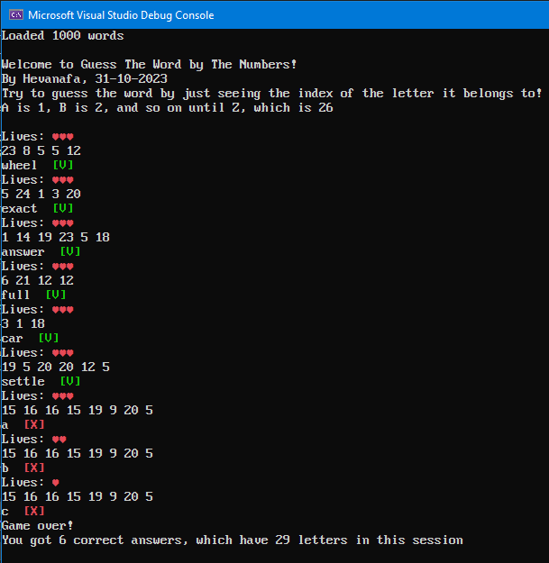

# Guess the Word by the Numbers

By Hevanafa, 31-10-2023

This game is a prototype of a puzzle game where the player has to guess the word just by seeing each letter's index on the alphabet.

The code in this project can be run with .NET 6.0 and above.

